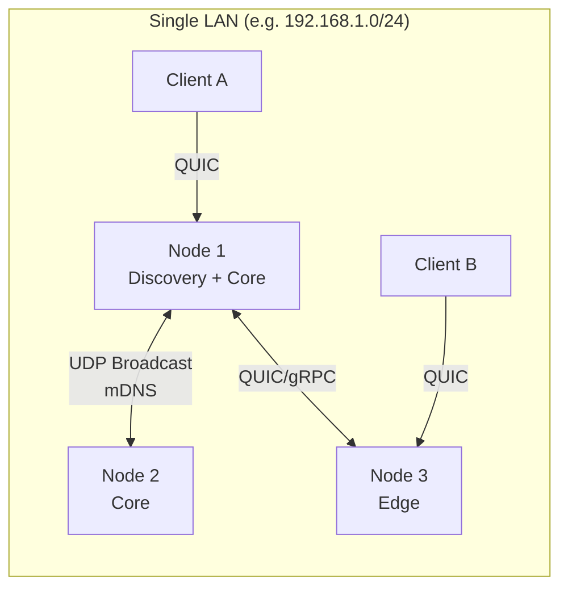
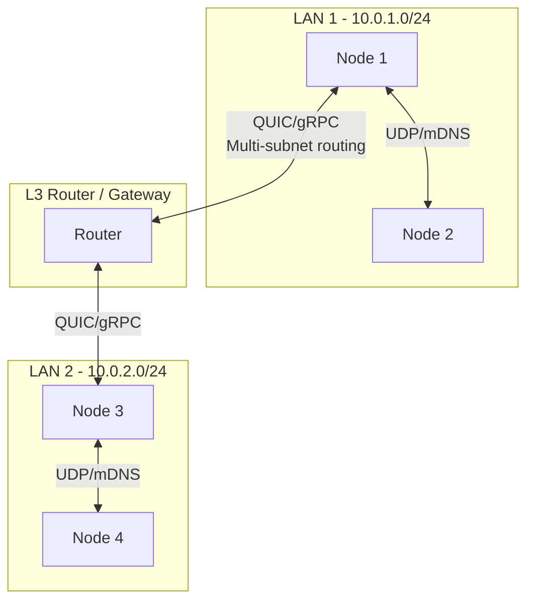
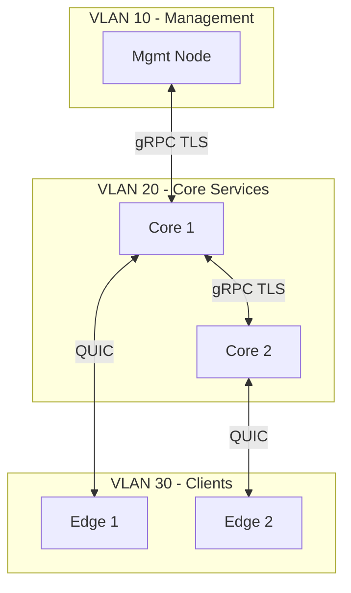

# Network Topology

## Single LAN

- **UDP broadcast** (e.g. 224.0.0.251:5353) and **mDNS** for service discovery within the subnet.
- **QUIC** (and WebSocket fallback) for client-to-node and node-to-node secure transport.
- All nodes share the same **ClusterID**; discovery filters by ClusterID to ignore other clusters.

## Multi-LAN (Multi-Subnet)

- **Multi-subnet routing**: Discovery can use configured peer list or optional relay nodes that span subnets.
- **Relay nodes**: Optional nodes with interfaces in multiple VLANs/LANs to propagate discovery and route traffic.
- **Static peer configuration**: For air-gapped or restricted networks, peer addresses can be supplied via config (no broadcast dependency).

## VLAN-Aware Networking

- **VLAN segmentation**: Core services, management, and client-facing edge can be placed in separate VLANs.
- **Firewall rules**: Allow only required ports (QUIC, gRPC, UDP discovery) between VLANs; deny by default.
- **mDNS**: Typically limited to single broadcast domain; cross-VLAN discovery via configured peers or relay.

## Port Matrix

| Purpose | Protocol | Port(s) | Direction |
|---------|----------|---------|-----------|
| mDNS discovery | UDP | 5353 | Within subnet |
| UDP broadcast discovery | UDP | Configurable (e.g. 5354) | Within subnet |
| QUIC (client & server) | UDP | 443 or configurable | Client ↔ Node, Node ↔ Node |
| WebSocket fallback | TCP | 443 or 8443 | Client ↔ Node |
| gRPC (internal) | TCP/TLS | 50051 (example) | Service ↔ Service |
| HTTP (admin/health) | TCP | 8080–8090 | Admin ↔ Services |

## Air-Gapped and Restricted Networks

- **No internet**: All binaries, CA roots, and config are deployed via offline media or internal package repo.
- **Discovery**: Rely on **static peer list** and **config-driven** cluster membership; disable UDP broadcast if not allowed.
- **Time sync**: Use local NTP server or manual sync; certificate validity and audit timestamps depend on it.
