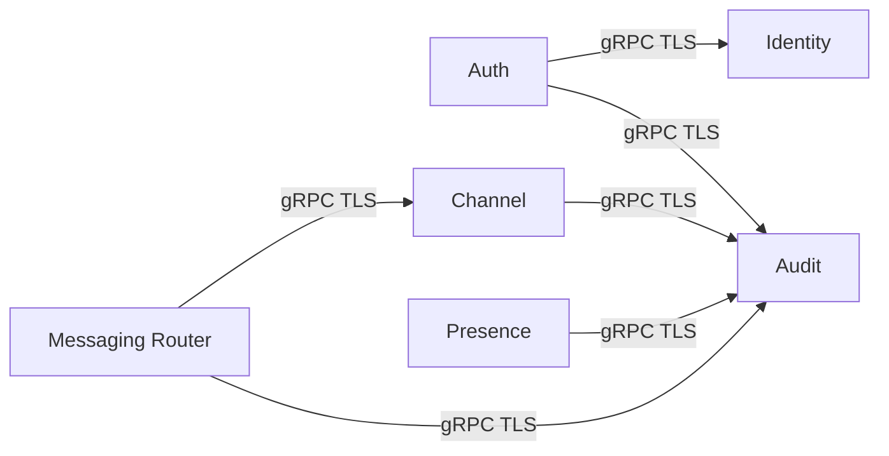

# Service Mesh Design

## Overview

Inter-service communication uses **TLS-authenticated gRPC** (and optionally HTTP for legacy endpoints). There is no external service mesh (e.g. Istio); the “mesh” is the set of **secure, authenticated links** between our own Go services.

## Communication Patterns

- **Service-to-service**: gRPC over TLS; each service has a **client certificate** (signed by local PKI) for mutual TLS (mTLS).
- **Client-to-service**: QUIC or WebSocket with TLS; client authenticates via **token** (JWT or opaque) after Auth Service validation; optional client cert for device binding.

## TLS and Certificates

- **Local PKI**: Root CA (offline or tightly controlled); issues server and client certs for all nodes and services.
- **Server certs**: Each service endpoint presents a certificate with SANs for its DNS name or IP.
- **Client certs**: Used for service identity (e.g. Messaging Router calling Audit); optional for end-user devices when device binding is required.

## Discovery and Addressing

- **In-cluster**: Services resolve each other by **service name** (e.g. `auth.lan-chat.svc`, `messaging.lan-chat.svc`) or by **static config** (list of host:port).
- **Discovery Service**: Provides node list and addresses for clients and for new nodes joining the cluster; does not replace gRPC service discovery.
- **Kubernetes (optional)**: If deployed on K8s, use ClusterIP services and optional headless services for stateful Raft.

## Observability

| Concern | Implementation |
|---------|----------------|
| **Logging** | Structured logs (JSON) from each service; correlation ID per request. |
| **Metrics** | Prometheus metrics (request count, latency, errors) on each service; scrape from admin network only. |
| **Tracing** | Optional: OpenTelemetry with trace ID propagated via gRPC metadata; store traces locally. |
| **Health** | `/health` HTTP or gRPC health check; liveness and readiness for orchestrators. |

## Resilience

- **Timeouts**: All gRPC calls have deadlines; configurable per client.
- **Retries**: Exponential backoff for idempotent operations; no retry for non-idempotent (e.g. audit write once).
- **Circuit breaker**: Optional per downstream service to avoid cascading failure.

## Summary

- **No sidecar proxy**: Services call each other directly over gRPC+TLS.
- **mTLS**: Service identity via client certificates from local CA.
- **Observability**: Logs, metrics, optional tracing; all consumed within the LAN (no SaaS).
