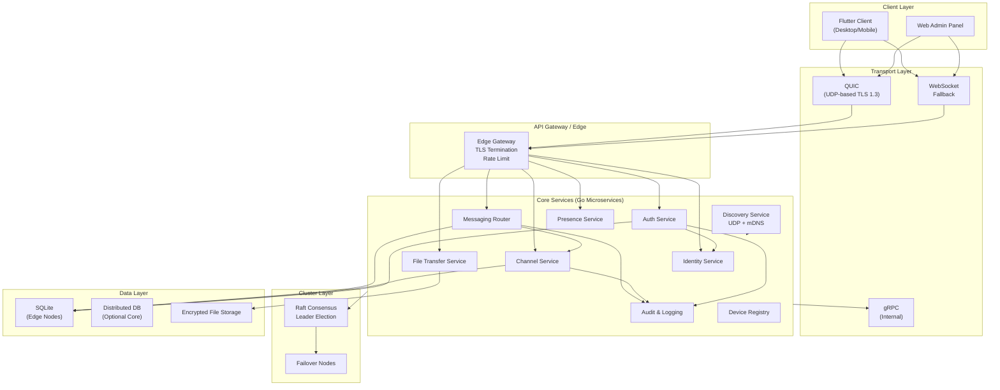

# Enterprise System Architecture

## Overview

The platform is a **LAN-native, offline-first, zero-cloud** communication system designed for high-security internal networks. All components run on-premise with no external SaaS dependency.

## High-Level Architecture Diagram

## Core Services

| Service | Responsibility | Transport | Storage |
|--------|----------------|-----------|---------|
| **Discovery Service** | Node discovery via UDP broadcast + mDNS | UDP 5353, mDNS | In-memory peer map |
| **Identity Service** | Account lifecycle, device binding | gRPC/HTTP | SQLite |
| **Auth Service** | Authentication, token issuance, RBAC | HTTP/gRPC | SQLite (users, roles) |
| **Messaging Router** | Topic-based routing, message broker, persistence | gRPC/WebSocket | SQLite |
| **Channel Service** | Channel CRUD, membership, governance | gRPC | SQLite |
| **File Transfer Service** | Chunked transfer, encrypted storage | HTTP/gRPC | Encrypted filesystem |
| **Presence Service** | Online/away/busy, last seen | gRPC/WebSocket | In-memory + optional SQLite |
| **Audit & Logging Service** | Append-only audit log, chain integrity | gRPC/HTTP | Append-only log file |
| **Device Registry** | Device identity, certificate binding | gRPC | SQLite |

## Design Principles

- **LAN-native**: All traffic stays on local network; no internet egress required.
- **Offline-first**: Clients and edge nodes operate with local cache when disconnected.
- **Zero-trust**: Every request is authenticated and authorized; no implicit trust by network location.
- **Fault tolerance**: Leader election, failover nodes, and local persistence for HA.
- **Security-first**: E2EE, local PKI, certificate-based auth, and full audit trail.

## Document Index

- [Network Topology](./network-topology.md) — Single LAN, multi-LAN, VLAN
- [Cluster Design](./cluster-design.md) — Raft, leader election, replication
- [Service Mesh](./service-mesh.md) — Inter-service communication, TLS, observability
