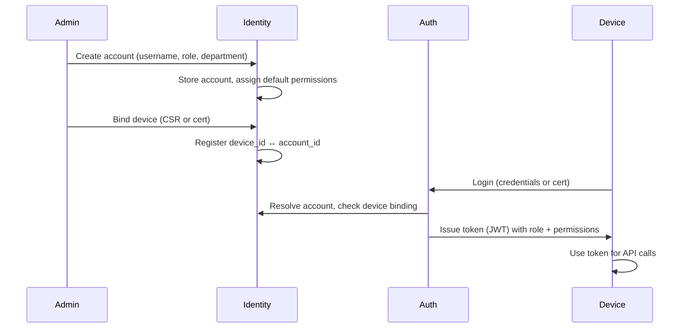

# Identity & Access Management (IAM) Model

## Overview

The platform uses an **account-based** IAM model with **role-based access control (RBAC)**, **permission matrix**, **device identity binding**, and **local PKI** under a **zero-trust** posture inside the LAN.

## Concepts

| Concept | Description |
|--------|-------------|
| **Account** | Human or system identity (e.g. user, service account) with a unique ID and credentials. |
| **Role** | Named set of permissions (e.g. `admin`, `member`, `auditor`). |
| **Permission** | Fine-grained right to perform an action on a resource (e.g. `channel:write`, `user:delete`). |
| **Device** | Client or node identified by certificate and optional hardware binding; can be bound to an account. |
| **Department / Segment** | Optional organizational unit for segmentation (e.g. by department, VLAN, trust zone). |

## Account Lifecycle

- **Identity Service**: Creates and stores accounts; manages device binding and department/segment.
- **Auth Service**: Authenticates (password or certificate); consults Identity for role and permissions; issues tokens.
- **Device binding**: Optional policy that only allows login from registered devices (certificate or device ID).

## Role-Based Access Control (RBAC)

- **Roles** are assigned to accounts (one primary role; optional secondary roles or overrides).
- **Permissions** are attached to roles via a **permission matrix** (see [RBAC Matrix](./rbac-matrix.md)).
- **Authorization**: On each request, the gateway or service resolves the token to (account_id, role, permissions) and checks the required permission for the action.

## Department Segmentation

- **Department** (or segment) is an attribute of an account and optionally of channels.
- **Channel governance**: Channels can be restricted to certain departments; only members of that department can join or read.
- **Cross-department**: Configurable; default can be deny, with explicit allow for specific roles (e.g. admin).

## Zero-Trust Inside LAN

- **No implicit trust by IP**: Every API call requires a valid token or mTLS client cert.
- **Least privilege**: Services run with minimal permissions; tokens carry only required claims.
- **Device attestation**: Optional TPM or hardware binding for high-security environments to tie device identity to hardware.

## Local PKI Integration

- **Root CA**: Offline or tightly controlled; signs server and client certificates.
- **Server certs**: Used for TLS on QUIC, WebSocket, gRPC.
- **Client certs**: Used for service-to-service mTLS and for device-bound user authentication.
- **Revocation**: CRL or OCSP (local); Auth and Identity check revocation before accepting a cert.

## Document Index

- [RBAC Matrix](./rbac-matrix.md) — Roles, permissions, and resource mapping.
