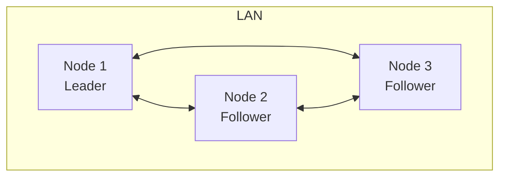

# Deployment Architecture

## Deployment Model

- **On-premise**: All components run in the customer’s data center or secure facility.
- **Air-gapped**: No internet; delivery via offline media; no external updates.
- **Edge computing**: Optional edge nodes in remote sites with local cache and offline capability.
- **Local cluster**: 3–5+ nodes for HA; Raft for consensus and failover.

## Topology Options

### Single Node (Dev / Small Site)

- One host runs: Discovery, Auth, Identity, Messaging Router, Channel, File Transfer, Presence, Audit, Device Registry.
- Single SQLite and single audit log; no Raft or single-node Raft.
- Suitable: Labs, small offices.

### Local Cluster (HA)

- Each node runs full set of services (or split core vs edge).
- Raft on dedicated port; leader handles cluster config.
- Data: Per-node SQLite with optional replication; or shared storage (NFS/san) where appropriate.
- Clients discover nodes via UDP/mDNS and connect to any node (or to leader for admin).

### Multi-LAN / VLAN

- **Core** in one VLAN (e.g. 10.0.1.0/24): Auth, Identity, Messaging, Channel, Audit.
- **Edge** in client VLAN (e.g. 10.0.2.0/24): Discovery, gateway, optional cache.
- **Relay** or static peer list for discovery and routing across subnets.
- Firewall: Allow only required ports between VLANs.

### Air-Gapped

- No multicast to internet; static peer list in config.
- Binaries and CA delivered via USB/sneakernet or internal repo.
- Updates: Same; no pull from internet.

## Container and Orchestration

- **Docker**: Each service can run as a container; `docker-compose` for single-node or small cluster (see `backend/deploy/docker-compose.yml`).
- **Kubernetes (optional)**: Helm chart for deployment; StatefulSet for Raft nodes; ConfigMaps/Secrets for config and certs; persistent volumes for SQLite and audit.
- **Bare metal / VMs**: Systemd units or init scripts; same binaries; config from files or env.

## Resource Placement

| Component | CPU | Memory | Storage | Notes |
|-----------|-----|--------|---------|------|
| Discovery | Low | Low | — | In-memory peer map |
| Auth | Low | Low | SQLite | Scale with users |
| Messaging Router | Medium | Medium | SQLite + log | Scale with message rate |
| Channel | Low | Low | SQLite | |
| File Transfer | Medium | Medium | Encrypted files | Scale with storage |
| Presence | Low | Low | In-memory / SQLite | |
| Audit | Low | Low | Append-only log | Retain per policy |
| Cluster (Raft) | Low | Low | Raft dir | 3 or 5 nodes for quorum |

## High Availability

- **Stateless services**: Multiple replicas behind internal LB or DNS.
- **Stateful (Raft)**: Odd number of nodes (3, 5); leader election and failover automatic.
- **Data**: Replicate SQLite via Raft log or async sync; or use single shared DB (e.g. NFS) with caution for locking.
- **Clients**: Retry on disconnect; reconnect to another node using discovery.

## Security at Deployment

- **Secrets**: Certs and keys from files or K8s Secrets; never in images or env logs.
- **Network**: Restrict service ports to management and client VLANs as needed.
- **User**: Run processes as non-root; read-only filesystem where possible.
