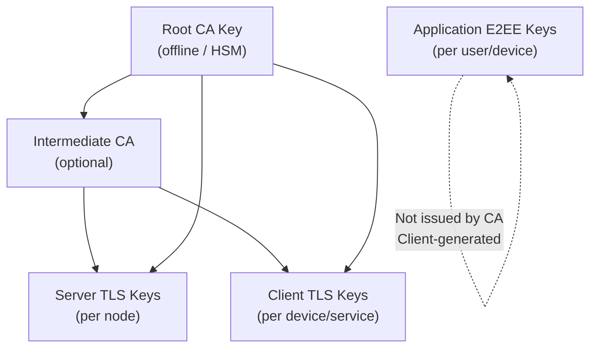

# Key Management System

## Overview

Keys are managed **locally**; no cloud KMS. Optional **HSM or TPM** for root CA and high-value keys in high-security deployments.

## Key Hierarchy

- **Root CA**: Signs intermediate or directly signs server/client certs; stored offline or in HSM/TPM; used only for issuance and CRL.
- **Server/client certs**: Issued by Root or Intermediate; used for TLS and device binding.
- **E2EE keys**: Generated and stored on client devices; not issued by CA; used for Double Ratchet and message signing.

## Storage Requirements

| Key | Storage | Access |
|-----|---------|--------|
| Root CA private key | Offline / HSM / TPM | Issuance and revocation only |
| Server TLS private key | Node disk (restricted permissions) or TPM | Node process only |
| Client TLS private key | Device keychain / TPM | Client app only |
| E2EE identity key | Device secure storage | Client app only |
| E2EE ratchet state | Device local DB (encrypted) | Client app only |

## Lifecycle

### Certificate Issuance

1. Entity generates key pair (on device or server).
2. CSR sent to CA (via Auth/Identity or PKI service over authenticated channel).
3. CA validates identity (e.g. device binding, admin approval); signs certificate.
4. Certificate and (if not device-generated) private key delivered securely; private key never leaves device when device-generated.

### Rotation

- **Server certs**: Rotate before expiry (e.g. 1 year); deploy new cert; restart or hot-reload; old cert can remain valid until expiry for graceful transition.
- **Client certs**: Same; re-enrollment before expiry.
- **E2EE keys**: Identity key can be long-lived; ratchet keys rotate automatically with each message (Double Ratchet).

### Revocation

- **CRL**: CA publishes Certificate Revocation List; Auth and gateway check CRL before accepting client cert.
- **OCSP**: Optional local OCSP responder for real-time revocation.
- **Device revoke**: Identity Service marks device as revoked; Auth rejects login from that device even if cert is still valid.

## Backup and Recovery

- **CA key**: Backed up in secure, offline manner; recovery procedure documented and tested.
- **Server keys**: Can be re-issued from CA; backup of encrypted private keys optional and must be access-controlled.
- **E2EE keys**: No server-side backup by design; loss of device may imply loss of session history unless backup is implemented client-side with secure escrow (policy-dependent).

## Optional: TPM / Hardware Binding

- **Server**: TPM can protect server TLS private key; binding to platform prevents key export.
- **Client**: TPM or secure enclave can protect identity key and ratchet state; optional hardware binding in Device Registry for high-security environments.
