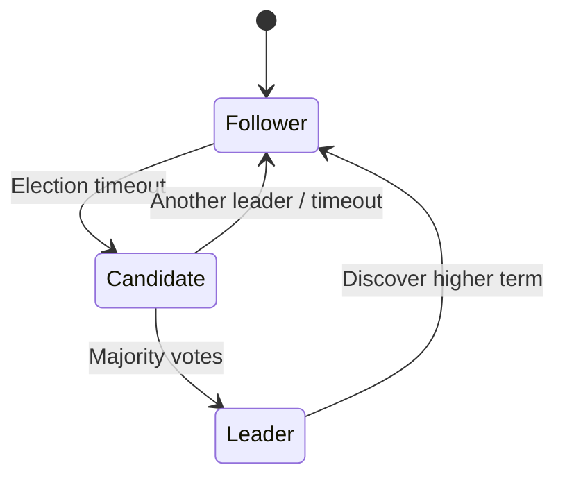
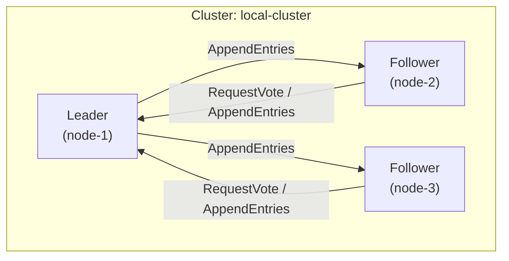

# Cluster Design

## Overview

The platform uses a **distributed local network cluster** with leader-based consensus for coordination, failover, and optional replication of critical state.

## Raft-Based Consensus

- **Raft** is used for leader election and replication of cluster metadata (member list, config).
- **Leader** handles cluster join/leave and coordinates optional distributed state (e.g. channel metadata, device registry).
- **Data plane** (messages, presence, audit) can remain local to each node with eventual sync, or be replicated via Raft log depending on deployment tier.

## Cluster Topology

- **NodeID**: Unique per node (e.g. `node-1`, `node-2`).
- **ClusterID**: Same for all nodes in one logical cluster (e.g. `local-cluster`).
- **Raft bind address**: Dedicated port (e.g. `:10001`) for Raft RPC.

## Failover and High Availability

| Component | HA Strategy |
|-----------|-------------|
| **Discovery** | Multiple nodes announce; clients and peers use first reachable or priority order. |
| **Auth / Identity** | Replicated via Raft or primary-replica with failover; tokens validated locally or via shared secret. |
| **Messaging Router** | Per-node SQLite; optional replication via Raft or async sync to other nodes. |
| **Presence** | In-memory with optional persistence; can be rebuilt from heartbeats after failover. |
| **Audit** | Append-only log; can be shipped to central node or replicated for compliance. |
| **Leader** | Raft failover; new leader elected automatically when current leader is lost. |

## Join Protocol

1. New node starts as **Follower**, discovers existing peers via UDP/mDNS or static config.
2. Node sends **Join** request to current **Leader** (e.g. `POST /join?node_id=node-4&addr=10.0.1.5:10001`).
3. Leader adds node to Raft cluster and replicates new configuration.
4. New node receives **AppendEntries** and becomes part of the cluster.

## Edge and Core Nodes

- **Core nodes**: Run Raft, hold persistent state, participate in leader election.
- **Edge nodes**: Optional lightweight nodes that proxy clients to core; can run SQLite for local cache and offline support; do not need to be Raft voters.

## Deployment Modes

| Mode | Description |
|------|-------------|
| **Single node** | One node runs all services; no Raft or with single-node Raft for future expansion. |
| **Local cluster** | 3–5 nodes on same LAN; full Raft quorum, failover. |
| **Multi-LAN cluster** | Core in one LAN, edge nodes in others; routing via relay or static peers. |
| **Air-gapped** | Static peer list; no multicast; all coordination over QUIC/gRPC with local CA. |
