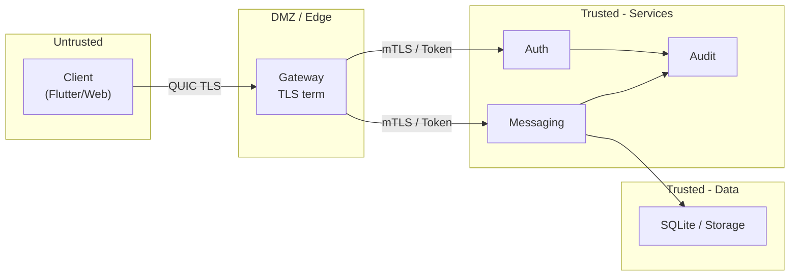

# Security Model

## Principles

- **Zero-trust on LAN**: No implicit trust by network location; every request is authenticated and authorized.
- **Defense in depth**: Transport TLS, E2EE for message content, signed/encrypted storage, and audit.
- **Least privilege**: Roles and permissions grant minimum required access; services use dedicated identities.
- **No cloud dependency**: All secrets, keys, and PKI are local; no external key escrow or SaaS.

## Trust Zones

- **Client**: Untrusted until authenticated; token or client cert proves identity.
- **Edge/Gateway**: Validates TLS and forwards requests with identity context; rate limiting and optional DDoS mitigation.
- **Trusted services**: Authenticate each other via mTLS; validate tokens and permissions.
- **Data layer**: Encrypted at rest (optional); access only via services with proper identity.

## Threat Model (Summary)

| Threat | Mitigation |
|--------|------------|
| Eavesdropping on wire | TLS 1.3 (QUIC/gRPC); E2EE for message payloads |
| Impersonation | Cert-based auth; JWT with short TTL; device binding |
| Tampering | Signatures on messages and audit log; TLS integrity |
| Replay | Nonces, timestamps, and optional sequence numbers in protocol |
| Privilege escalation | RBAC; strict permission checks; audit of role changes |
| Insider access to plaintext | E2EE so server only sees ciphertext; key material in client/HSM |
| Compromised node | Revoke cert; exclude from cluster; rotate keys; audit review |
| Physical access to storage | Encrypted volumes; TPM-bound keys where required |

## Secure Device Provisioning

1. **Bootstrap**: Device receives root CA (or intermediate) and optional config via secure out-of-band (USB, manual) or from trusted admin.
2. **CSR**: Device generates key pair; sends CSR to Identity/CA service (over authenticated channel).
3. **Issuance**: CA signs client cert; device stores in secure storage (keychain/TPM).
4. **Binding**: Identity Service binds device_id (from cert or hardware ID) to user account; Auth enforces binding on login.

## Trust Zones (Operational)

- **Management VLAN**: Admin console, CA, config; restricted access.
- **Core VLAN**: Backend services; no client direct access.
- **Client VLAN**: Edge nodes and client traffic only.

## Compliance Alignment

- **Audit trail**: All security-relevant events (login, role change, channel access, message delete) logged with actor, resource, timestamp; append-only and hash-chained.
- **Data retention**: Configurable retention for messages and audit; secure deletion procedure.
- **Access review**: RBAC matrix and department segmentation support periodic access review.
